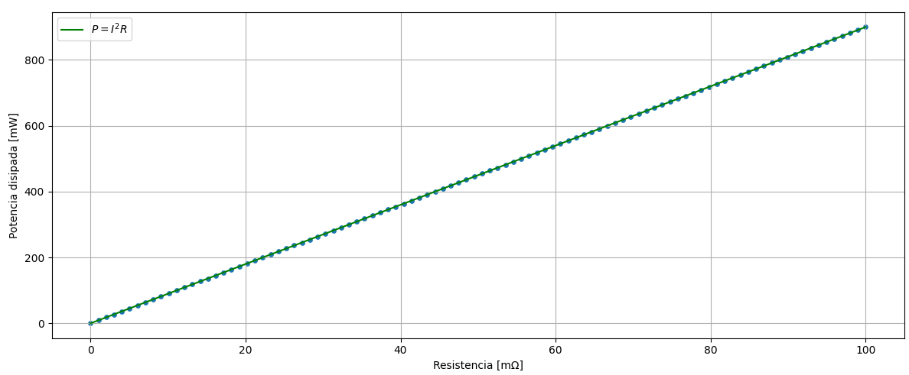
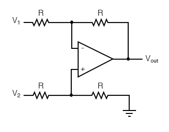

# Contexto de requerimientos 

## Eléctricos:
### Requerimientos:
* El equipo ha de tener una salida de voltaje con rango mínimo de 0-30 V.
* El equipo ha de tener una salida de corriente con rango mínimo de de 0-3A.
* El equipo ha de tener una potencia de salida de 90 W como mínimo.
* La resolución de la medición del voltaje y corriente deben de ser al menos de 10 mV y 1 mA.
### Restricciones:
* Entrada de voltaje de 60 Hz y 120 V rms.
* El rizado del equipo no puede ser mayor a 50 mV.
* Al cambiar la carga de la fuente el cambio en el voltaje debe de ser menor al 2%.
* El equipo no debe de presentar fallas por interferencias electromagnéticas en un entorno de laboratorio.

# Medición de corriente.

## Resistencia Shunt

### Consideraciones de maxima corriente y potencia disipada

La medición de corriente en sistemas electrónicos se basa fundamentalmente en la **detección de la caída de tensión a través de una resistencia de sensado (shunt)**, cuyo valor es conocido y cuidadosamente seleccionado. A partir de esta caída de tensión, se obtiene la corriente mediante la aplicación de la ley de Ohm, y posteriormente se acondiciona la señal (generalmente mediante amplificación) para su procesamiento, control o digitalización.

El calculo de la resistencia parte de la corriente maxima que va a ser medida, junto a la tension maxima que se espera medir. Esta tension se elige de tal manera, para que la disipación de potencia sea permisible y así mismo, el valor de resistencia eléctrica.  Para facilitar el estudio del fenómeno propuesto, se dispone una grafica de Potencia contra resistencia:

La selección de la potencia nominal de la resistencia de sensado (shunt) es un aspecto crítico en el diseño, ya que impacta directamente tanto el costo como la precisión del sistema. Existen dos razones principales que justifican esta elección:

#### Costo de las resistencias

A medida que aumenta la potencia nominal de una resistencia:

- Se incrementa su tamaño físico (encapsulado más grande)
- Se utilizan materiales de mayor calidad térmica
- El precio crece de forma significativa

En aplicaciones como una fuente de laboratorio, sobredimensionar innecesariamente la potencia del shunt puede elevar el costo del sistema sin aportar beneficios reales. Por ello, se busca un equilibrio entre margen de seguridad y costo.
#### Deriva térmica

Cuando la resistencia disipa potencia, su temperatura aumenta, lo que genera dos efectos importantes:

1. **Cambio en el valor resistivo**  
   Debido al coeficiente de temperatura (TCR), la resistencia varía con la temperatura:

   $$ R(T) = R_0 \cdot (1 + \alpha \cdot \Delta T) $$

   donde _alpha_  es el coeficiente de temperatura de la resistencia _TCR_ ([Vishay - Temperature Coefficient of Resistance (TCR)](https://www.vishay.com/docs/30405/whitepapertcr.pdf)).

2. **Error en la medición de corriente**  
   Dado que la corriente se calcula a partir de la caída de tensión en el shunt, cualquier variación en su valor introduce un error directo en la medición:

   $$ I = \frac{V}{R} $$

   Si \( R \) aumenta con la temperatura, la corriente estimada será menor que la real, y viceversa.
#### Implicación de diseño

Una resistencia con mayor potencia nominal:

- Opera a menor temperatura para una misma disipación
- Presenta menor deriva térmica
- Mejora la estabilidad y precisión del sistema

Esto se debe a que, a medida que la resistencia aumenta su temperatura, su valor óhmico varía según su coeficiente de temperatura (TCR), introduciendo errores directos en la medición.

Por esta razón, es necesario seleccionar una resistencia cuya potencia nominal sea superior a la potencia realmente disipada, de modo que opere con un margen térmico adecuado y se minimicen las variaciones de su valor.

Sin embargo, esto debe balancearse con el costo y el espacio disponible. En diseños de precisión, es común utilizar resistencias de bajo TCR y con un margen de potencia suficiente (típicamente entre 2× y 4× la potencia esperada) para reducir los errores térmicos.

### Consideraciones de resolución de medición de 1mA

Tal como se establece en los requerimientos eléctricos, se desea medir la corriente con una resolución de 1 mA. Esto representa un reto importante, ya que al utilizar una **resistencia de sensado (shunt) de bajo valor** ( para minimizar pérdidas de potencia) la caída de tensión generada es extremadamente pequeña:

$$
V_{shunt} = I \cdot R = 1\,\text{mA} \cdot 25\,\text{m}\Omega = 25\,\mu\text{V}
$$

La medición de diferencias de potencial en el orden de microvoltios introduce limitaciones prácticas significativas, por lo que la resolución efectiva del sistema no depende únicamente del principio de medición, sino del desempeño de toda la cadena de adquisición.

En particular, la capacidad de medir correctamente esta señal dependerá de los siguientes factores:

- **Valor de la resistencia shunt**: determina el nivel de señal disponible, pero también las pérdidas de potencia y el calentamiento.
- **Offset del amplificador**: puede ser comparable o incluso mayor que la señal a medir, introduciendo errores significativos.
- **Ganancia del sistema de amplificación**: permite escalar la señal a un rango utilizable, pero amplifica también el ruido y los errores.
- **Ruido eléctrico**: puede enmascarar señales de baja magnitud, especialmente en entornos conmutados.
- **Resolución del ADC**: define el nivel mínimo detectable una vez digitalizada la señal.
- **Deriva térmica**: tanto del shunt como del amplificador, afecta la estabilidad de la medición.

Por lo tanto, el diseño del sistema de sensado de corriente debe abordarse de manera integral, considerando el compromiso entre precisión, eficiencia y complejidad del sistema.
## Topología de amplificación y detección.

Existen principalmente dos formas de medir corriente mediante el uso de una resistencia de sensado (shunt), a partir de las cuales surgen diferentes consideraciones de diseño:

- Amplificador operacional en topología de red diferencial.
- Amplificador de instrumentación.

Para seleccionar cuál opción es más adecuada, es necesario plantear una serie de cuestionamientos que dependen directamente de los requerimientos del sistema. En la siguiente Figura se presenta el diagrama de red diferencial en amplificador operacional:

### ¿Cuál es el nivel de precisión requerido?

Si la aplicación requiere medir corrientes pequeñas o alcanzar alta resolución (por ejemplo, del orden de mA o inferior), los errores asociados a:

- Offset del amplificador  
- Desbalance de resistencias  
- Deriva térmica  

se vuelven críticos. En estos casos, los amplificadores de instrumentación ofrecen ventajas claras debido a su alto CMRR, bajo offset y excelente estabilidad térmica.

---

### ¿Cuál es el rango de voltaje en modo común?

Este es uno de los factores más determinantes.

- En configuraciones **low-side**, la resistencia de sensado se ubica **entre la carga y tierra** (GND), por lo que el voltaje en sus terminales está cercano a 0 V. Esto permite el uso de amplificadores operacionales convencionales o de instrumentación sin mayores complicaciones.

- En configuraciones **high-side**, la resistencia de sensado se ubica entre la **fuente de alimentación y la carga**, por lo que ambos terminales del shunt se encuentran a un voltaje elevado respecto a tierra. Aunque la diferencia de voltaje a medir es pequeña, está “montada” sobre un **nivel alto de voltaje**, lo que limita severamente el uso de amplificadores tradicionales.

En este caso, es necesario emplear amplificadores diseñados específicamente para sensado de corriente (current sense amplifiers), los cuales están optimizados para operar con altos voltajes de modo común.

###  ¿Qué tan crítico es el rechazo de modo común (CMRR)?

En la medición de corriente mediante shunt, se trabaja con:

- Señales diferenciales pequeñas (mV)
- Sobre niveles de modo común potencialmente altos

Un bajo CMRR introduce errores significativos en la medición. Por ello:

- Las implementaciones discretas dependen fuertemente del matching de resistencias  
- Los amplificadores integrados (instrumentación o current sense) ofrecen mejor desempeño garantizado  
### ¿Qué tan complejo puede ser el diseño?

Un amplificador diferencial discreto requiere:
  - Selección cuidadosa de resistencias (tolerancia y TCR)
  - Buen diseño de layout
  - Compensación de errores

Un amplificador de instrumentación o un current sense amplifier:
  - Reduce la complejidad
  - Mejora la repetibilidad
  - Disminuye el riesgo de errores de implementación

### ¿Se requiere flexibilidad en la ganancia?

Los **amplificadores de instrumentación** permiten ajustar la ganancia fácilmente mediante un resistor externo, mientras que, los **amplificadores de sensado de corriente** suelen tener ganancias fijas (20, 50, 100, 200 V/V), lo que simplifica el diseño pero reduce flexibilidad  

###  Consideración adicional 

Además de las dos opciones iniciales, en aplicaciones prácticas modernas es común emplear una tercera alternativa basada en Amplificadores de sensado de corriente (current sense amplifiers), como ya se indico anteriormente. 

Estos dispositivos integran:

- Amplificación diferencial (La misma topología de la imagen)
- Red de resistencias de alta precisión
- Capacidad de operación en high-side

y están específicamente optimizados para medir la caída de tensión en resistencias shunt, ofreciendo un balance adecuado entre precisión, simplicidad y robustez.

En aplicaciones como fuentes de laboratorio, donde existen:

- Voltajes elevados (hasta 30 V)
- Requerimientos de estabilidad
- Necesidad de robustez

los amplificadores de sensado de corriente representan, en la mayoría de los casos, la solución más adecuada, mientras que los amplificadores de instrumentación y las implementaciones discretas quedan reservados para escenarios más específicos o de mayor exigencia en precisión.

## Propuestas.

Se propone el uso de un circuito integrado de amplificación para sensado de corriente (*current sense amplifier*). Entre las distintas alternativas disponibles, se selecciona el **INA181**, debido a su adecuado desempeño para la aplicación considerada, su facilidad de integración y su bajo costo.

Datasheet:  

Este dispositivo permite realizar mediciones en configuración *high-side*, incorpora una ganancia precisa definida internamente y reduce significativamente la complejidad del diseño en comparación con implementaciones discretas, especialmente en términos de rechazo de modo común y estabilidad relativa del sistema.

No obstante, esta elección está sujeta a limitaciones físicas inherentes al proceso de medición, las cuales deben ser consideradas en el diseño.
### Limitaciones físicas del sensado

La principal limitación proviene del nivel de señal a medir. Para una resistencia shunt de bajo valor, la caída de tensión asociada a corrientes pequeñas se encuentra en el orden de los microvoltios. Como se indico anteriormente:

$$
V_{shunt} = 1\,\text{mA} \cdot 25\,\text{m}\Omega = 25\,\mu\text{V}
$$

En este régimen:

- La señal útil es del mismo orden de magnitud que el offset de entrada del amplificador.
- El ruido eléctrico del sistema puede ser comparable a la señal medida.
- Las variaciones térmicas afectan directamente tanto al shunt como al amplificador.

En el caso del INA181, el offset de entrada puede alcanzar valores del orden de cientos de microvoltios, lo que equivale a varios miliamperios de error en la medición.

### Dependencia con condiciones de operación

El error introducido por el sistema no es constante, sino que depende de múltiples variables:

- Temperatura, que afecta el valor del shunt (TCR) y el offset del amplificador.
- Voltaje de modo común, especialmente relevante en configuraciones *high-side*.
- Variabilidad entre dispositivos, asociada a tolerancias de fabricación.

Esto implica que un ajuste estático del sistema no es suficiente para garantizar precisión en todo el rango de operación.
### Implicaciones en el diseño del sistema

Dado que no es posible garantizar la precisión requerida únicamente mediante hardware analógico, el diseño debe considerar un enfoque integral:

- El lazo de control analógico debe operar con una señal proporcional, aun cuando esta contenga errores de offset moderados. En este contexto, el lazo no requiere una medición absoluta exacta de la corriente, sino una **relación consistente** entre la señal medida y la real. Por ejemplo, un error de offset equivalente a ±5 mA en un rango de 0–3 A representa un error relativo inferior al 0.2%, el cual no compromete la estabilidad ni el funcionamiento del control, sino únicamente la exactitud del valor absoluto.

- La señal de sensado debe ser escalada adecuadamente para aprovechar el rango dinámico del ADC, maximizando así la resolución efectiva del sistema.

- La precisión absoluta de la medición debe ser corregida en el dominio digital, mediante calibración de offset y ganancia.

Adicionalmente, es posible utilizar el pin **REF** del amplificador para introducir un desplazamiento controlado en la salida, lo que permite realizar un ajuste fino del offset en condiciones específicas (por ejemplo, forzando que la medición sea cero cuando no circula corriente). Sin embargo, este método solo compensa el error en un punto de operación, ya que el offset varía con temperatura y condiciones de funcionamiento.

Adicionalmente, es necesario:

- Seleccionar el valor del shunt considerando el compromiso entre amplitud de señal y pérdidas de potencia.
- Utilizar resistencias con bajo coeficiente de temperatura.
- Implementar un diseño de layout que minimice ruido y errores de acoplamiento.
# Medición de voltaje.
